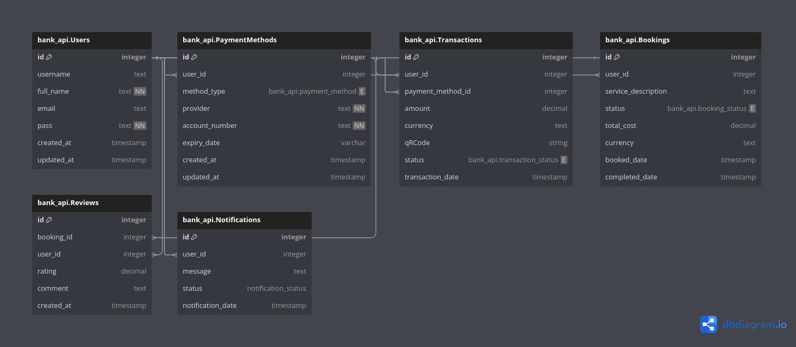

## Description
Backend Test for genesis Lab

## DataBase Design


The DB diagram code is also given that can be inserted in ``` https://dbdiagram.io/``` to get the same result.
```bash

Enum bank_api.payment_method{
  card
  crypto
  wallet
}

Enum bank_api.transaction_status {
  pending
  completed
  failed
}

Enum bank_api.booking_status {
  booked
  completed
}

Enum bank_api.notification_status {
  unread
  read
}

Table bank_api.Users {
  id integer [pk, increment]
  username text [unique]
  full_name text [not null]
  email text [unique]
  pass text [not null]
  created_at timestamp [default: `now()`]
  updated_at timestamp
  indexes {
    email [name: "users_email_index"]
    username [name:"users_username_index"]
  }
}

Table bank_api.PaymentMethods {
  id integer [pk, increment] 
  user_id integer [ref: > bank_api.Users.id] 
  method_type bank_api.payment_method 
  provider text [not null]
  account_number text [not null]
  expiry_date varchar [null] 
  created_at timestamp [default: `now()`]
  updated_at timestamp
  indexes {
    user_id [name: "payment_methods_user_id_index"]
  }
}

Table bank_api.Transactions {
  id integer [pk, increment] 
  user_id integer [ref: > bank_api.Users.id] 
  payment_method_id integer [ref: > bank_api.PaymentMethods.id] 
  amount decimal
  currency text
  qRCode string
  status bank_api.transaction_status 
  transaction_date timestamp
  indexes {
    user_id [name: "transactions_user_id_index"]
    payment_method_id [name: "transactions_payment_method_id_index"]
    transaction_date [name: "transactions_transaction_date_index"]
    status [name: "transactions_status_index"]
    (user_id,status) [name: "transactions_user_with_status_transactions_index"]
  }
}

Table bank_api.Bookings {
  id integer [pk, increment] 
  user_id integer [ref: > bank_api.Users.id] 
  service_description text 
  status bank_api.booking_status 
  total_cost decimal
  currency text
  booked_date timestamp
  completed_date timestamp [null] 
  indexes {
    user_id [name: "bookings_user_id_index"]
    status [name: "bookings_status_index"]
    booked_date [name: "bookings_booked_date_index"]
    completed_date [name: "bookings_completed_data_index"]
  }
}

Table bank_api.Reviews {
  id integer [pk, increment] 
  booking_id integer [ref: > bank_api.Bookings.id] 
  user_id integer [ref: > bank_api.Users.id] 
  rating decimal 
  comment text 
  created_at timestamp [default: `now()`]
  indexes {
    booking_id [name: "reviews_booking_id_index"]
  }
}

Table bank_api.Notifications {
  id integer [pk, increment] 
  user_id integer [ref: > bank_api.Users.id] 
  message text 
  status notification_status 
  notification_date timestamp
  indexes {
    user_id [name: "notifications_user_id_index"]
    status [name: "notifications_status_index"]
  (user_id,status) [name: "notifications_user_with_status_notifications_index"]
  }
}


```

## Installation

```bash
$ pnpm install
```

## Running the app

```bash
# development
$ pnpm run start

# watch mode
$ pnpm run start:dev

# production mode
$ pnpm run start:prod
```

## Test

```bash
# e2e main deliverable tests
$ pnpm run test:e2e

# unit tests(extra added)
$ pnpm run test


